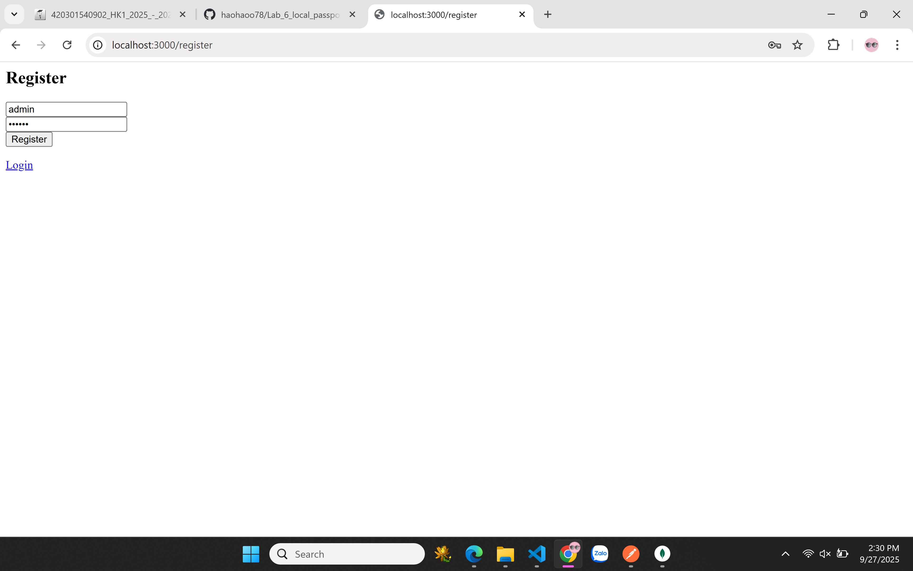
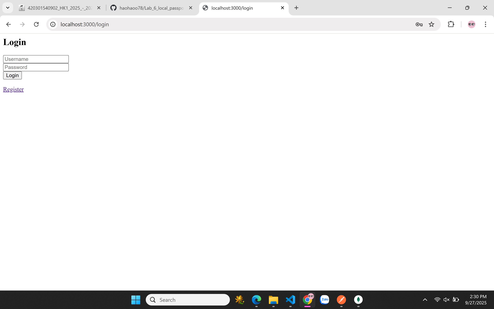
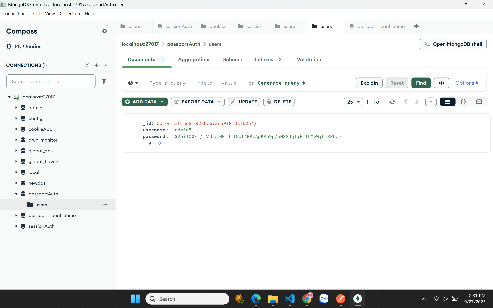
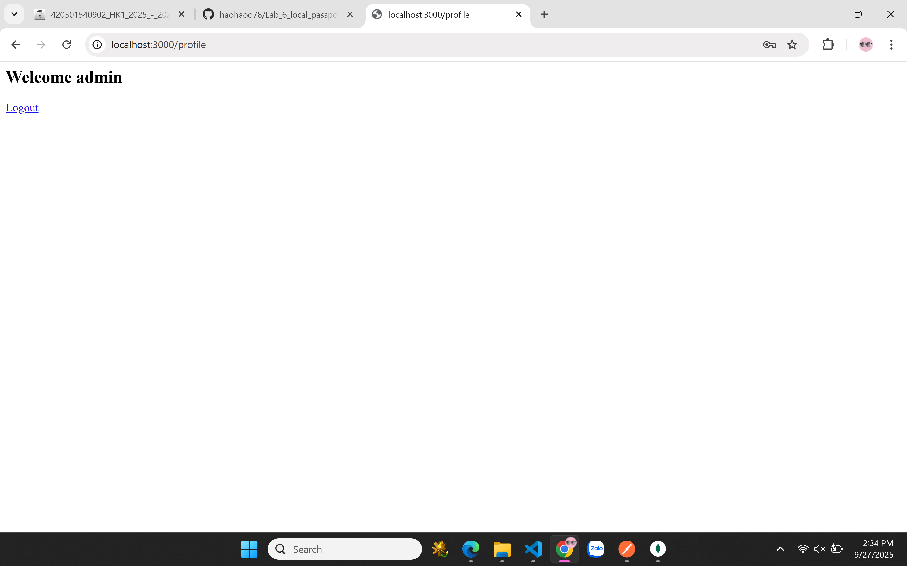

4. local_passport_website: Run by yourself 

a. register
http://localhost:3000/register

check in database

b. login
http://localhost:3000/login

c. profile
login thành công
http://localhost:3000/profile

d.logout
bấm logout ở giao diện login thành công sẽ đẩy về trang login

